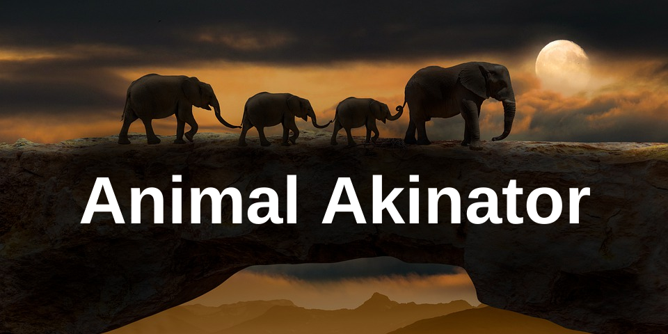

## Animal Akinator


Animal Akinator is an interactive guessing game that challenges players to think of an animal while the program attempts to identify it through a series of yes-or-no questions. Inspired by the original [Akinator website](https://en.akinator.com/).

## Setup
Clone the GitHub repo, make sure you have Git installed.
```
git clone https://github.com/PrintN/Animal-Akinator.git
```
Then cd into the directory.
```
cd Animal-Akinator/
```
And finally run the script.
```
python3 main.py
```

## FAQ
<details>
<summary><strong>How does Animal Akinator work?</strong></summary>
The Animal Akinator is written in Python. It asks the player a series of yes-or-no questions to narrow down the possibilities. The program evaluates the effectiveness of each question based on how many animals would be eliminated by the answer. The game continues until it can confidently guess the animal the player is thinking of based on their responses.</details>
<details>
<summary><strong>How does the original Akinator work?</strong></summary>
The exact workings of the original Akinator are unclear since its source code is closed source. However, it likely utilizes a large database of information to systematically narrow down possible characters through a series of yes-or-no questions. Additionally, it may employ fuzzy logic to handle "maybe" responses and use machine learning techniques to recognize patterns in user answers, improving its guessing accuracy over time.</details>
<details>
<summary><strong>How do I submit an issue?</strong></summary>
You can submit an issue by visiting the project's GitHub repository and using the "Issues" tab to report bugs or request features.</details>
<details>
<summary><strong>Can I contribute to Animal Akinator?</strong></summary>
Yes! Contributions are welcome. You can contribute by forking the repository, making changes, and submitting a pull request on GitHub.</details>

## License
This project is Unlicensed. Read more [here](LICENSE).